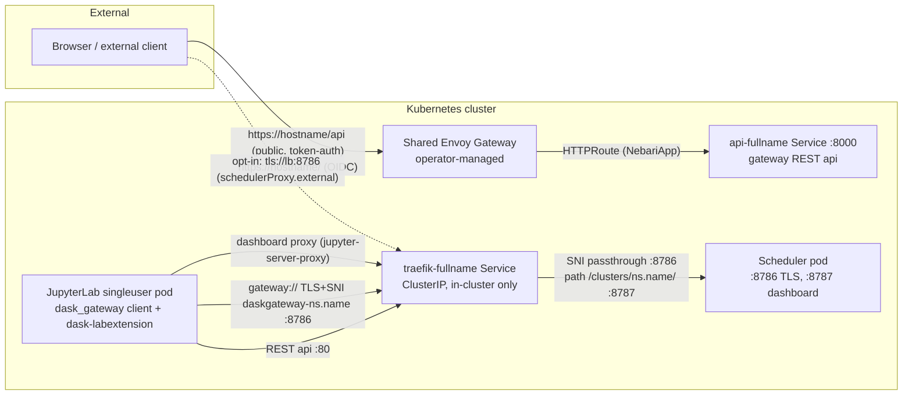

# dask-gateway-pack

A Nebari software pack that wraps the upstream
[dask-gateway Helm chart](https://helm.dask.org) (pinned to **2026.3.0**) and
ships a `NebariApp` CR so the nebari-operator wires routing, TLS, Keycloak
OIDC, and a landing-page card. Built for **data-science-pack**
(JupyterHub/JupyterLab) users: notebooks create multi-tenant Dask clusters
with the `dask_gateway` client and the JupyterHub API token they already have.

**Full documentation: <https://packs.nebari.dev/dask-gateway-pack/>**
(source under [`docs/`](docs/))

## Architecture in one paragraph

Only the gateway **REST API** is exposed through the shared Envoy Gateway
(via the NebariApp; `/api` public + token-authenticated by dask-gateway
itself, `/` OIDC). The upstream chart's Traefik stays deployed but strictly
**in-cluster** (ClusterIP): it is the scheduler TLS/SNI-passthrough proxy
(dedicated `:8786` entrypoint) and dashboard proxy that the upstream
kube-controller is hard-wired to. JupyterLab pods reach it directly, and
dashboards render inside JupyterLab through dask-labextension's
jupyter-server-proxy handler. No forked images, no shared-Gateway mutation.
Off-cluster dask clients are an opt-in interim LoadBalancer
(`schedulerProxy.external`, scheduler TCP only, mTLS end-to-end) until
[nebari-operator#169](https://github.com/nebari-dev/nebari-operator/issues/169)
lands.



## Install

On Nebari, deploy an ArgoCD `Application` (`project: nebari-apps`) pointing
at `chart/` with:

```yaml
nebariapp:
  enabled: true
  hostname: dask-gateway.<your-domain>
```

The target namespace must be labeled `nebari.dev/managed=true`. Standalone
(no Nebari): `helm install dask-gateway chart` with
`dask-gateway.gateway.auth.type=simple`. Full walkthrough:
[Quick Start](https://packs.nebari.dev/dask-gateway-pack/quick-start/).

## Documentation

- [Introduction](https://packs.nebari.dev/dask-gateway-pack/) — what the pack is and when to use it
- [Quick Start](https://packs.nebari.dev/dask-gateway-pack/quick-start/) — ArgoCD and standalone installs
- [Architecture](https://packs.nebari.dev/dask-gateway-pack/architecture/) — exposure map, auth model, no-fork rationale
- [Using from the Data Science Pack](https://packs.nebari.dev/dask-gateway-pack/consuming-from-data-science-pack/) — the notebook side: dask-labextension, dashboards, pixi version matching
- [Deploying alongside the data-science-pack](https://packs.nebari.dev/dask-gateway-pack/deploying-alongside-data-science-pack/) — cross-namespace Helm wiring, shared service token, NetworkPolicy + route-timeout stopgaps
- [Configuration](https://packs.nebari.dev/dask-gateway-pack/configuration/) — the chart values surface
- [NebariApp CRD](https://packs.nebari.dev/dask-gateway-pack/nebariapp-crd-reference/) — the CRD fields this pack uses
- [Roadmap & Limitations](https://packs.nebari.dev/dask-gateway-pack/roadmap/) — off-cluster access and the operator work it waits on

## Development

```sh
# The Helm chart lives under chart/ (provenance-collector-pack layout,
# required by the helm-repository sync-chart action).
helm dependency build chart        # vendors the pinned dask-gateway subchart
helm lint chart
helm template test chart --set nebariapp.enabled=true --set nebariapp.hostname=dask.example.com

# Rebuild the cluster-image lock after editing images/cluster/pixi.toml:
pixi lock --manifest-path images/cluster

# Docs site (Astro + Starlight):
cd docs && npm install && npm run dev
```
