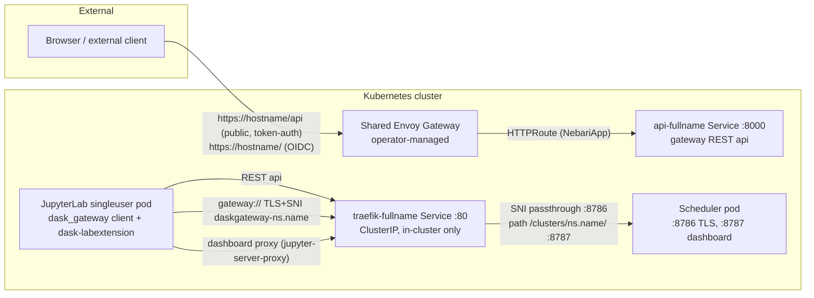

# dask-gateway-pack

A Nebari software pack that wraps the upstream
[dask-gateway Helm chart](https://helm.dask.org) (pinned to **2026.3.0**) and
ships a `NebariApp` CR (`reconcilers.nebari.dev/v1`) that exposes **only the
gateway REST API** through the shared Envoy Gateway. Everything else —
scheduler traffic and dashboards — stays in-cluster, which is exactly what
the real consumer needs: **data-science-pack** (JupyterHub/JupyterLab)
notebook users creating Dask clusters with the `dask_gateway` Python client
and the JupyterHub api token they already have.

No forked images, no upstream patches, no shared-Gateway modifications:
the subchart runs stock (gateway server + kube-controller + its Traefik
proxy), with Traefik locked to a ClusterIP Service so it is never publicly
reachable.

## Architecture



| Traffic | Path | Exposure |
|---|---|---|
| Gateway REST api | NebariApp → operator `HTTPRoute` → `api-<fullname>:8000` | public (via Envoy) |
| Scheduler TCP (client↔scheduler, TLS+SNI) | upstream Traefik (`IngressRouteTCP` per cluster, SNI passthrough) | **in-cluster only** (ClusterIP) |
| Per-cluster dashboards | upstream Traefik (`IngressRoute` per cluster) → rendered in JupyterLab via dask-labextension | **in-cluster only** |

Why this shape (verified against dask-gateway 2026.3.0 source):

- The `dask_gateway` client always reaches schedulers **through the proxy**
  — it dials `gateway://<proxy-address>/<cluster>` with TLS SNI
  `daskgateway-<ns>.<name>` (`dask_gateway/client.py`, `comm.py`); there is
  no direct-to-scheduler mode. The proxy is therefore mandatory.
- The upstream kube-controller is **hard-wired to Traefik**
  (`traefik.io/v1alpha1` IngressRoute/IngressRouteTCP,
  `backends/kubernetes/controller.py`) — removing Traefik entirely would
  mean replacing the controller, i.e. a fork. We keep it, but internal-only:
  a ClusterIP Service is fully supported upstream and nothing about the
  controller/Traefik pair needs external exposure when all clients are
  in-cluster.
- Dashboards need no ingress for JupyterLab users: **dask-labextension**
  proxies the dashboard through the user's own Jupyter server
  (`dask_labextension/dashboardhandler.py`, a `jupyter_server_proxy`
  handler) — the singleuser pod fetches the in-cluster dashboard URL and
  the browser only ever talks to the Jupyter server, which is already
  exposed and hub-authenticated.

### Components

| Component | Workload | Image |
|---|---|---|
| Gateway server | `api-<fullname>` Deployment + Service :8000 | upstream `ghcr.io/dask/dask-gateway-server` |
| Kube controller | `controller-<fullname>` Deployment | upstream `ghcr.io/dask/dask-gateway-server` |
| Traefik proxy (internal) | `traefik-<fullname>` Deployment + **ClusterIP** Service :80 | upstream `docker.io/traefik` |
| Scheduler/worker pods | created per DaskCluster | **first-party** `quay.io/nebari/dask-gateway-pack-cluster` (`images/cluster/`, pixi-locked) |

The cluster image is the pack's only first-party image — the same split
classic Nebari made (upstream gateway/controller images, first-party
`quay.io/nebari/nebari-dask-worker` built from the `nebari-dask`
metapackage in `nebari-docker-images`).

## Auth model (hybrid Model A)

- `auth.enabled: true`, `enforceAtGateway: true` — the operator creates an
  Envoy `SecurityPolicy` + Keycloak client; browser traffic on the root
  route goes through Keycloak SSO, and the landing-page card is private.
- `routing.publicRoutes: [/api]` — the REST api bypasses OIDC at Envoy
  because the `dask_gateway` client is programmatic. It is NOT
  unauthenticated: the gateway runs `gateway.auth.type: jupyterhub` and
  validates every request's JupyterHub api token against the hub REST API.
  Since the data-science-pack hub authenticates users through
  `KeyCloakOAuthenticator`, identity still chains back to Keycloak.
- Dashboards are reachable only in-cluster, at unguessable
  `/clusters/<ns>.<uuid>/` paths on Traefik's ClusterIP (classic-Nebari
  parity); browser access goes through the user's hub-authenticated Jupyter
  server.

## Consuming from the data-science-pack (JupyterLab)

How DSP works today (verified against `data-science-pack`, `nebi`,
`nb-nebi-kernels`): the JupyterLab image is pixi-built and contains **no
dask at all**; user kernels come from **nebi-managed pixi workspaces**
(`nb-nebi-kernels` exposes every workspace environment as a kernel). So
"client environment" means two different environments:

1. **The kernel environment (nebi pixi workspace)** — where notebook code
   runs `from dask_gateway import Gateway`. This is where
   dask/distributed/dask-gateway versions must match the worker image.
   The pack's cluster image is pixi-built from
   [`images/cluster/pixi.toml`](images/cluster/pixi.toml) — copy its three
   pins (`dask`, `distributed`, `dask-gateway`) into your workspace's
   `pixi.toml` and compatibility holds by construction. (Recommended
   follow-up: publish that manifest as a shared nebi environment in the org
   registry so users just `nebi pull` it.)
2. **The JupyterLab server environment** — where `dask-labextension` (the
   in-lab clusters sidebar + inline dashboard panes) runs. Classic Nebari
   shipped `dask_labextension >= 5.3.0` in its jupyterlab image; the DSP
   jupyterlab pixi env currently does NOT include it. **DSP change
   required** for the full in-lab experience: add `dask-labextension` (and
   `dask-gateway`, which its cluster factory imports) to
   `images/jupyterlab/pixi.toml` in data-science-pack.

### Discovery configuration (DSP side)

Register the hub service (z2jh generates the api token this pack's gateway
reads) and point the dask client config at the in-cluster Traefik:

```yaml
jupyterhub:
  hub:
    services:
      dask-gateway: {}   # token appears in Secret "hub" under hub.services.dask-gateway.apiToken

  singleuser:
    extraEnv:
      # dask config env convention: DASK_GATEWAY__<KEY> => gateway.<key>.
      # With these set, notebook code is just:
      #   from dask_gateway import Gateway; gw = Gateway(); gw.new_cluster()
      DASK_GATEWAY__ADDRESS: "http://traefik-dask-gateway-pack.<namespace>"
      DASK_GATEWAY__PROXY_ADDRESS: "tcp://traefik-dask-gateway-pack.<namespace>:80"
      # Send the JUPYTERHUB_API_TOKEN every singleuser pod already carries:
      DASK_GATEWAY__AUTH__TYPE: "jupyterhub"
      # dask-labextension "NEW" button -> GatewayCluster:
      DASK_LABEXTENSION__FACTORY__MODULE: "dask_gateway"
      DASK_LABEXTENSION__FACTORY__CLASS: "GatewayCluster"
```

Notes:

- Replace `traefik-dask-gateway-pack` with the actual Traefik Service
  (`kubectl get svc -l app.kubernetes.io/name=dask-gateway`); it is
  `traefik-<fullname>` (`<release>` if the release name contains
  "dask-gateway", else `<release>-dask-gateway`).
- Leave `DASK_GATEWAY__PUBLIC_ADDRESS` **unset**: the client then derives
  `cluster.dashboard_link` from the (in-cluster) address, which is exactly
  what dask-labextension's server-side proxy needs to reach — dashboards
  render inline in JupyterLab, and in a browser tab served through the
  user's own Jupyter server (hub-authenticated). A public dashboard URL
  would be wrong here because dashboards are not externally routed in this
  version.
- `PROXY_ADDRESS` uses the shared web port (upstream
  `traefik.service.ports.tcp.port: web`): Traefik multiplexes HTTP and the
  scheduler's TLS/SNI traffic on one entrypoint.
- Classic Nebari achieved the same discovery by mounting a `dask-etc`
  ConfigMap (`gateway.yaml`) at `/etc/dask` in singleuser pods. Env vars
  are equivalent (dask reads both) and avoid cross-chart ConfigMap
  coupling; dask-labextension reads the same dask config, so env vars and
  the labextension are complementary, not alternatives.
- If the z2jh singleuser NetworkPolicy restricts egress, allow egress to
  this namespace on port 80 (Traefik) — the api Service :8000 is optional
  (Traefik proxies /api too).

### Cross-namespace installs

Set explicitly:

```yaml
dask-gateway:
  gateway:
    auth:
      jupyterhub:
        apiToken: "<token also registered under jupyterhub.hub.services.dask-gateway.apiToken>"
        apiUrl: "http://hub.<jupyterhub-namespace>:8081/hub/api"
```

## Deploying on Nebari

Author an ArgoCD `Application` with `project: nebari-apps` (see the
software-pack-template README for the full snippet) and set:

```yaml
nebariapp:
  enabled: true
  hostname: dask-gateway.<your-domain>
```

The target namespace must be labeled `nebari.dev/managed=true` (or use
`syncPolicy.managedNamespaceMetadata` as in
[.github/ci/dask-gateway-pack-application.yaml](.github/ci/dask-gateway-pack-application.yaml)).

## Cluster options exposed to users

Use `dask-gateway.gateway.extraConfig` to append Python to
`dask_gateway_config.py` — e.g. `c.Backend.cluster_options` with an
`Options(Select("profile", ...), handler=...)` block (commented example in
`values.yaml`). Classic Nebari's gateway_config.py is a good reference for
richer options (env selection, per-profile node selectors, user env vars).

## Roadmap / current limitations

- **No off-cluster dask clients.** The REST api is public, but scheduler
  TCP is in-cluster only, so external `dask_gateway` clients can list/create
  clusters yet cannot connect to them. Scheduler traffic is TLS+SNI
  passthrough (`daskgateway-<ns>.<name>`), which maps 1:1 onto Gateway API
  `TLSRoute` — blocked on a **nebari-operator TLSRoute / `routing.tcp`
  feature**; a ready-to-file feature request lives at
  [docs/operator-tlsroute-feature-request.md](docs/operator-tlsroute-feature-request.md).
- **No externally shareable dashboard URLs.** Dashboards are viewable only
  through each user's Jupyter server (dask-labextension) or in-cluster.
  External dashboard routing rides on the same operator feature
  (per-cluster HTTPRoutes) and is intentionally out of scope for v0.1.
- **DSP jupyterlab image needs `dask-labextension`** (see the DSP section).
- **Traefik is an internal implementation detail** of the upstream chart
  (its kube-controller only knows Traefik CRs). If upstream ever grows a
  pluggable route backend, this pack can drop Traefik without a fork.

## Development

```sh
helm dependency update .           # generates/refreshes Chart.lock
helm lint .
helm template test . --set nebariapp.enabled=true --set nebariapp.hostname=dask.example.com

# Rebuild the cluster-image lock after editing images/cluster/pixi.toml:
pixi lock --manifest-path images/cluster
```
