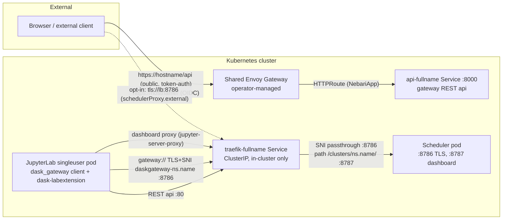

The Dask Gateway Pack is a **Nebari Software Pack** that wraps the upstream
[dask-gateway Helm chart](https://helm.dask.org) (pinned to **2026.3.0**) and
ships a `NebariApp` CR so the
[nebari-operator](https://github.com/nebari-dev/nebari-operator) wires
routing, TLS, Keycloak OIDC, and a landing-page card. Its target consumer is
the **data-science-pack** (JupyterHub/JupyterLab): notebook users create Dask
clusters with the `dask_gateway` Python client using the JupyterHub API token
they already have.

No forked images, no upstream patches, no shared-Gateway modifications: the
subchart runs stock (gateway server + kube-controller + its Traefik proxy),
with Traefik locked to a ClusterIP Service so it is never publicly reachable.

## Ingress model at a glance

Only the gateway **REST API** is exposed through the shared Envoy Gateway.
Scheduler traffic and dashboards stay in-cluster — which is exactly what
in-cluster JupyterLab clients need:

## When to use it

- You run the **data-science-pack** and want notebook users to launch
  elastic, multi-tenant Dask clusters without giving them cluster-admin
  anything — the gateway creates and tears down scheduler/worker pods per
  user, authenticated with the JupyterHub tokens they already carry.
- You want dashboards rendered **inside JupyterLab** (via
  dask-labextension) rather than yet another public endpoint.
- Off-cluster dask clients are possible as an opt-in
  ([Roadmap & Limitations](/roadmap/)).

## Guides

- [Quick Start](/quick-start/) — deploy on Nebari via ArgoCD, or standalone with Helm.
- [Architecture](/architecture/) — what is exposed where, and why there is no fork.
- [Using from the Data Science Pack](/consuming-from-data-science-pack/) — hub service, client env vars, version matching.

## Reference

- [Configuration](/configuration/) — the chart values surface.
- [NebariApp CRD](/nebariapp-crd-reference/) — the fields this pack uses.
- [Roadmap & Limitations](/roadmap/) — off-cluster access today and the operator work it waits on.
